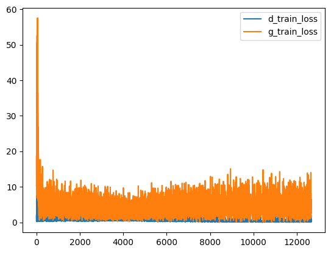
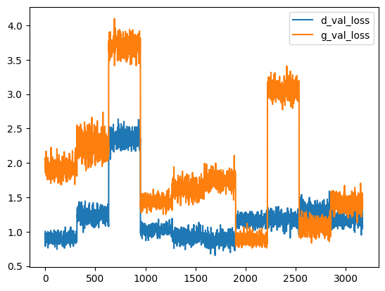
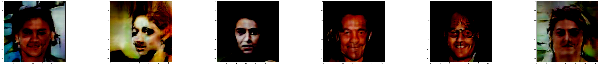

# DCGAN Project

## Overview

This project implements a Deep Convolutional Generative Adversarial Network (DCGAN) using Flax and JAX. The model is trained to generate realistic images based on a latent noise vector.

## Results

### Training and Validation Loss

Below are the training and validation loss curves:

**Training Loss:**


**Validation Loss:**


### Generated Samples

Here are some sample images generated by the DCGAN:

**Sample 1:**


**Sample 2:**


**Sample 3:**


## Setup Instructions

To set up the project, follow these steps:

1. Clone the repository:

   ```bash
   git clone <repository-url>
   cd dcgan
   ```

2. Install the required dependencies:

   ```bash
   pip install -r requirements.txt
   ```

   Alternatively, you can install dependencies directly from the `pyproject.toml` file:

   ```bash
   pip install flax==0.10.4 grain==0.2.12 "jax[cuda]==0.4.34" matplotlib>=3.10.6 opencv-python>=4.12.0.88 orbax-checkpoint==0.11.5 pathlib>=1.0.1
   ```

3. Ensure Python 3.12 or higher is installed.

## Training the Model

The training notebook is available in the `notebooks` folder. Open `dcgan-with-flax.ipynb` to view the training process and experiment with the model.

## Running Inference

To generate images using the trained DCGAN model, run the `main.py` script:

```bash
python main.py --output ./outputs/generated_image.png --seed 42
```

- `--output`: Path to save the generated image (default: `./outputs/<random-uuid>.png`).
- `--seed`: Random seed for reproducibility (default: random value).

Example:

```bash
python main.py --output ./outputs/sample_image.png --seed 12345
```

This will generate an image and save it to the specified path.
